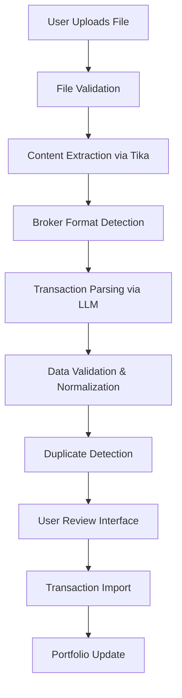

# Design Document

## Overview

The broker file parser feature enhances the existing portfolio management system by providing a comprehensive file upload, parsing, and transaction import workflow. The system builds upon the current LLM-based parsing approach while adding robust file handling, broker format detection, transaction validation, duplicate detection, and user review capabilities.

The design leverages the existing Apache Tika integration for file content extraction and extends the current exchange mapping system to support automatic broker detection and improved transaction processing.

## Architecture

### High-Level Flow



### System Components

1. **File Upload Handler**: Manages file upload, validation, and temporary storage
2. **Content Extractor**: Uses Apache Tika to extract text from various file formats
3. **Broker Detector**: Automatically identifies broker format based on file content patterns
4. **Transaction Parser**: Enhanced LLM-based parsing with broker-specific prompts
5. **Data Validator**: Validates and normalizes parsed transaction data
6. **Duplicate Detector**: Identifies potential duplicate transactions
7. **Review Interface**: Frontend component for transaction preview and editing
8. **Import Service**: Creates validated transactions in the database

## Components and Interfaces

### 1. File Upload Service

**Location**: `lib/file-upload.ts`

```typescript
interface FileUploadResult {
  fileId: string;
  fileName: string;
  fileSize: number;
  mimeType: string;
  content: string;
}

interface FileUploadOptions {
  maxSize: number; // 10MB default
  allowedTypes: string[];
  portfolioId: string;
}

class FileUploadService {
  async uploadAndExtract(
    file: File,
    options: FileUploadOptions
  ): Promise<FileUploadResult>;
  async validateFile(file: File, options: FileUploadOptions): Promise<void>;
  private async extractContent(
    buffer: Buffer,
    fileName: string
  ): Promise<string>;
}
```

### 2. Broker Detection Service

**Location**: `lib/broker-detection.ts`

```typescript
interface BrokerDetectionResult {
  broker: string;
  confidence: number;
  detectedPatterns: string[];
}

interface BrokerPattern {
  broker: string;
  patterns: RegExp[];
  requiredColumns?: string[];
  headerPatterns?: RegExp[];
}

class BrokerDetectionService {
  async detectBroker(content: string): Promise<BrokerDetectionResult | null>;
  private matchPatterns(
    content: string,
    patterns: BrokerPattern[]
  ): BrokerDetectionResult[];
  private analyzeCSVStructure(content: string): string[];
}
```

### 3. Enhanced Transaction Parser

**Location**: `lib/transaction-parser.ts`

```typescript
interface ParsedTransaction {
  assetSymbol: string;
  assetName: string;
  assetType: "stock" | "crypto" | "cash" | "other";
  type: "buy" | "sell" | "deposit" | "withdraw";
  quantity: number;
  price: number;
  date: string;
  currency: string;
  exchange: string;
  notes?: string;
  confidence: number;
  rawData: Record<string, unknown>;
}

interface ParsingResult {
  transactions: ParsedTransaction[];
  errors: ParsingError[];
  summary: {
    totalFound: number;
    successfullyParsed: number;
    errorsCount: number;
  };
}

class TransactionParserService {
  async parseTransactions(
    content: string,
    broker: string
  ): Promise<ParsingResult>;
  private generateBrokerSpecificPrompt(broker: string): string;
  private validateParsedData(transactions: ParsedTransaction[]): ParsingError[];
}
```

### 4. Duplicate Detection Service

**Location**: `lib/duplicate-detection.ts`

```typescript
interface DuplicateMatch {
  newTransaction: ParsedTransaction;
  existingTransaction: Transaction;
  matchScore: number;
  matchReasons: string[];
}

interface DuplicateDetectionResult {
  duplicates: DuplicateMatch[];
  uniqueTransactions: ParsedTransaction[];
}

class DuplicateDetectionService {
  async detectDuplicates(
    newTransactions: ParsedTransaction[],
    portfolioId: string
  ): Promise<DuplicateDetectionResult>;

  private calculateMatchScore(
    newTx: ParsedTransaction,
    existingTx: Transaction
  ): number;
}
```

### 5. Transaction Review Interface

**Location**: `components/transaction-review.tsx`

```typescript
interface TransactionReviewProps {
  transactions: ParsedTransaction[];
  duplicates: DuplicateMatch[];
  onTransactionEdit: (index: number, transaction: ParsedTransaction) => void;
  onDuplicateAction: (
    duplicate: DuplicateMatch,
    action: "skip" | "import" | "merge"
  ) => void;
  onImport: (transactions: ParsedTransaction[]) => void;
}

interface TransactionEditDialog {
  transaction: ParsedTransaction;
  onSave: (transaction: ParsedTransaction) => void;
  onCancel: () => void;
}
```

## Data Models

### Enhanced Parsing Schema

```typescript
// Extends existing schema with additional metadata
export const EnhancedTransactionSchema = z.object({
  assetSymbol: z.string(),
  assetName: z.string(),
  assetType: z.enum(["stock", "crypto", "cash", "other"]),
  type: z.enum(["buy", "sell", "deposit", "withdraw"]),
  quantity: z.number(),
  price: z.number(),
  date: z.string(),
  currency: z.string(),
  exchange: z.string(),
  notes: z.string().optional(),
  confidence: z.number().min(0).max(1),
  rawData: z.record(z.unknown()),
});

export const ParsingResultSchema = z.object({
  transactions: z.array(EnhancedTransactionSchema),
  errors: z.array(
    z.object({
      row: z.number().optional(),
      field: z.string().optional(),
      message: z.string(),
      severity: z.enum(["warning", "error"]),
    })
  ),
  summary: z.object({
    totalFound: z.number(),
    successfullyParsed: z.number(),
    errorsCount: z.number(),
  }),
});
```

### Broker Pattern Configuration

```typescript
export const BrokerPatterns: BrokerPattern[] = [
  {
    broker: "xtb",
    patterns: [/XTB/i, /Position.*Symbol.*Type.*Volume.*Open time/i],
    requiredColumns: ["Position", "Symbol", "Type", "Volume", "Open time"],
    headerPatterns: [/Open time.*Close time/i],
  },
  {
    broker: "binance",
    patterns: [/Binance/i, /Date\(UTC\).*Type.*Asset.*Amount/i],
    requiredColumns: ["Date(UTC)", "Type", "Asset", "Amount"],
  },
  {
    broker: "coinbase",
    patterns: [
      /Coinbase/i,
      /Timestamp.*Transaction Type.*Asset.*Quantity Transacted/i,
    ],
    requiredColumns: [
      "Timestamp",
      "Transaction Type",
      "Asset",
      "Quantity Transacted",
    ],
  },
];
```

## Error Handling

### Error Types and Recovery

1. **File Upload Errors**

   - File size exceeded: Clear error message with size limits
   - Unsupported format: List of supported formats
   - Corrupted file: Suggest re-downloading from broker

2. **Parsing Errors**

   - Broker not detected: Error message with supported brokers list
   - LLM parsing failure: Retry mechanism with simplified prompt
   - Invalid data format: Detailed field-level error messages

3. **Validation Errors**

   - Missing required fields: Highlight specific missing data
   - Invalid date formats: Suggest correct format
   - Negative quantities/prices: Flag for user review

4. **Import Errors**
   - Database connection issues: Retry mechanism
   - Constraint violations: Detailed error explanation
   - Partial import failures: Transaction-level success/failure reporting

### Error Recovery Strategies

- **Graceful Degradation**: Continue processing valid transactions even when some fail
- **User Guidance**: Provide actionable error messages with suggested fixes
- **Retry Mechanisms**: Automatic retry for transient failures
- **Partial Success Handling**: Allow import of successfully parsed transactions

## Testing Strategy

### Unit Tests

1. **File Upload Service**

   - File validation with various formats and sizes
   - Content extraction accuracy
   - Error handling for corrupted files

2. **Broker Detection Service**

   - Pattern matching accuracy for each supported broker
   - False positive/negative detection rates
   - Edge cases with mixed or unclear formats

3. **Transaction Parser**

   - LLM response parsing and validation
   - Schema compliance verification
   - Error handling for malformed LLM responses

4. **Duplicate Detection**
   - Matching algorithm accuracy
   - Performance with large transaction sets
   - Edge cases with similar but distinct transactions

### Integration Tests

1. **End-to-End File Processing**

   - Complete workflow from upload to import
   - Multi-broker file processing
   - Error recovery scenarios

2. **Database Integration**
   - Transaction creation and portfolio updates
   - Constraint handling and rollback scenarios
   - Performance with large imports

### User Acceptance Tests

1. **File Upload Experience**

   - Drag-and-drop functionality
   - Progress indicators and feedback
   - Error message clarity

2. **Review Interface**
   - Transaction editing capabilities
   - Duplicate handling workflows
   - Import confirmation and success feedback

### Performance Tests

1. **Large File Handling**

   - Files with 10,000+ transactions
   - Memory usage optimization
   - Processing time benchmarks

2. **Concurrent Processing**
   - Multiple users uploading simultaneously
   - Resource contention handling
   - Queue management for large files

### Test Data Requirements

- Sample broker files from each supported broker
- Edge case files (corrupted, mixed formats, empty)
- Large transaction datasets for performance testing
- Files with known duplicate scenarios
